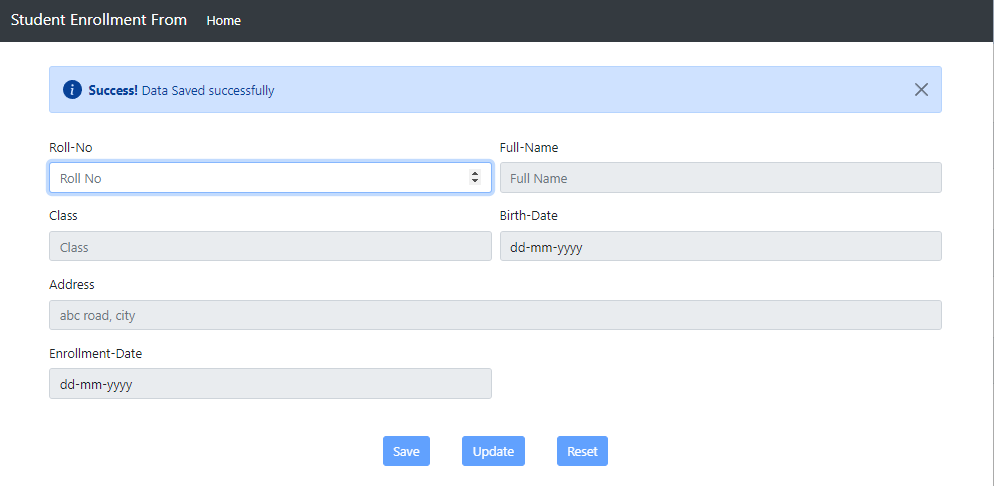

# Student-Enrollment-Form
## Description 
This is a web based html form for student enrollment using JsonPowerDB as Database 
JsonPowerDB is used to perform CURD operation 

# Benefits of using JsonPowerDB
* Nimble, simple to use, in memory, real time
* Schema free - easy to maintain
* Serverless support - fast development - cuts time to market
* Built around the world's fastest indexing engine PowerIndex
* Webservices API - Low Dev Cost
* Multiple Security Layers
* A single instance - Million Indexes
* Inbuilt support for querying multiple databases
* Serverside Native NoSQL - best performance
* Multi-mode database - One solution to a variety of data

# Use cases
* All RDMS use cases.
* All key-value use cases.
* All document use cases.
* Time series/geospatial analytics.
* Real time application for data analytics.
* Live working HTML templates.
* Any software application that needs backend DB. (Dynamic web-apps/Mobile/Desktop Apps)

# TECH STACK USED
* HTML
* CSS
* JAVASCRIPT 
* JsonPowerDB ( As Database)

# Screenshots:

# Illustrations:
* **UPDATE** : when student roll number is already present in database then student information is fetched from database and filled in respective feild then user can UPDATE student information 
* **SAVE** : If student roll number is not existed in database then we can fill other field and save in database
* **clear** : By this we can clear all field of form and with this except first field (roll-no) other field are disabled until user enter any roll number
* **Alert** : This website uses disposable Alter prompt using bootstrap

# HOW TO USE

* **Initially**

If roll number is valid and that roll number is existing in database

* **Fetching student data using roll number**
  If student already present in database, then all field filled with that student information
  
  
  otherwise, other fields are enabled after user input roll number
  
* **Updation of student details**
  In order to update student details input roll number, and then we can update the student data
  
  
  
  

* **Adding new student data**

  Enter new roll number and then all other fields are enabled and then after filling student information we can save this data into database only if input is valid
  
  
  
  

  
  # Sources
  * Introduction to JsonPowerDB - V2.0 course  on https://careers.login2explore.com/
  * [Bootstrap](https://getbootstrap.com/docs/5.0/getting-started/introduction/) 
